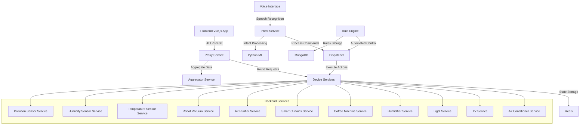

# SmartIntent: Smart Home Control System

A comprehensive smart home automation system built with microservices architecture, featuring voice control, automated rules, and a responsive web interface.

## 🏗️ System Architecture



## 📦 Project Structure

```
smartintent/
├── Backend_Code/              # Device microservices
│   ├── airmaster/            # Air conditioner control
│   ├── tvmaster/             # TV control
│   ├── lightmaster/          # Light control
│   ├── humidifiermaster/     # Humidifier control
│   ├── coffeemaster/         # Coffee machine control
│   ├── curtainsmaster/       # Smart curtains control
│   ├── airpurifiermaster/    # Air purifier control
│   ├── vacuummaster/         # Robot vacuum control
│   ├── tempmaster/           # Temperature sensor
│   ├── humiditymaster/       # Humidity sensor
│   ├── pollutionmaster/      # Pollution sensor
│   └── VoiceInterface/       # Speech recognition service
├── Middleware_Code/          # Integration and business logic
│   ├── aggregator-service/   # Device status aggregation
│   ├── dispatcher/           # Command dispatch
│   ├── IntentService/        # Voice command processing
│   ├── ProxyService/         # API gateway
│   ├── rule-engine/          # Automation rules
│   └── mode-manager/         # System mode management
└── Frontend_Code/            # Web interface
    ├── final_version.html    # Main control panel
    ├── styles.css           # UI styling
    └── components/          # Vue.js components
```

## 🎯 Core Components

### Backend Services (Node.js)

Each device has its own microservice that:
- Manages device state using Redis for persistence
- Provides REST API endpoints for control and status
- Validates input parameters
- Handles device-specific logic

**Example: Air Conditioner Service**
```javascript
// Control endpoint
POST /ac/control
{
  "action": "turn_on",
  "temperature": 24,
  "mode": "cool",
  "fanSpeed": "medium"
}

// Status endpoint
GET /ac/status
```

### Middleware Services

#### Rule Engine
- **Technology**: Node.js + MongoDB
- **Purpose**: Automated device control based on sensor conditions
- **Features**:
  - Define trigger conditions (temperature > 25°C)
  - Execute actions (turn on AC)
  - Rule validation and management

#### Intent Service
- **Technology**: Python + ML models
- **Purpose**: Process natural language voice commands
- **Features**:
  - Speech-to-text conversion
  - Intent classification
  - Parameter extraction

#### Proxy Service
- **Technology**: Node.js
- **Purpose**: API gateway for frontend requests
- **Features**:
  - Request routing
  - Load balancing
  - Authentication (if implemented)

#### Aggregator Service
- **Technology**: Node.js
- **Purpose**: Collect and consolidate device statuses
- **Features**:
  - Real-time status polling
  - Data formatting
  - Error handling

### Frontend (Vue.js)

- **Responsive Design**: Mobile-first approach
- **Internationalization**: English and Chinese support
- **Real-time Updates**: 5-second polling interval
- **Voice Control**: Integrated speech recognition
- **Device Controls**: Detailed control panels for each device

### Voice Interface (Python)

- **Speech Recognition**: Whisper-based online processing
- **Real-time Processing**: WebSocket connections
- **Audio Handling**: Multi-format support

## 🚀 Quick Start

### Prerequisites

- **Node.js** (v14+)
- **Python** (v3.8+)
- **Redis** (v6+)
- **MongoDB** (v4.4+)
- **Docker** (optional, for containerized deployment)

### Local Development Setup

1. **Clone the repository**
```bash
git clone https://github.com/ucd-soc2/smartintent.git
cd smartintent
```

2. **Start Redis and MongoDB**
```bash
# Using Docker
docker run -d -p 6379:6379 redis:latest
docker run -d -p 27017:27017 mongo:latest
```

3. **Install and start backend services**
```bash
# Install dependencies for all services
cd Backend_Code/airmaster && npm install && cd ../..
cd Backend_Code/tvmaster && npm install && cd ../..
# ... repeat for other services

# Start services (each in separate terminal)
cd Backend_Code/airmaster && npm start
cd Backend_Code/tvmaster && npm start
# ... repeat for other services
```

4. **Install and start middleware services**
```bash
# Install and start each middleware service
cd Middleware_Code/aggregator-service && npm install && npm start
cd Middleware_Code/dispatcher && npm install && npm start
cd Middleware_Code/ProxyService && npm install && npm start
cd Middleware_Code/rule-engine && npm install && npm start

# For Python services
cd Middleware_Code/IntentService && pip install -r requirements.txt && python intent_server.py
```

5. **Start voice interface**
```bash
cd Backend_Code/VoiceInterface
pip install -r requirements.txt
python whisper_online_server.py
```

6. **Open the frontend**
```bash
cd Frontend_Code
# Serve using any HTTP server, e.g.:
python -m http.server 8080
# or
npx http-server
```

7. **Access the application**
   - Open browser to `http://localhost:8080`
   - Load `final_version.html`

### Docker Deployment

Each service includes a `Dockerfile` and Knative YAML configuration for container deployment:

```bash
# Build and run a service
cd Backend_Code/airmaster
docker build -t airmaster .
docker run -p 3000:3000 airmaster
```

## 📡 API Documentation

### Device Control API

All device services follow a consistent API pattern:

#### Control Device
```http
POST /{device}/control
Content-Type: application/json

{
  "action": "turn_on|turn_off",
  "parameter1": value1,
  "parameter2": value2
}
```

#### Get Device Status
```http
GET /{device}/status
```

### Supported Devices

| Device | Endpoint | Parameters |
|--------|----------|------------|
| Air Conditioner | `/ac` | action, temperature (16-30), mode (cool/heat), fanSpeed (low/medium/high) |
| TV | `/tv` | action, channel (1-20), volume (0-100) |
| Light | `/light` | action, brightness (1-5) |
| Humidifier | `/humidifier` | action, level (1-5) |
| Coffee Machine | `/coffee` | action, brewMode (Espresso/Latte/Americano) |
| Smart Curtains | `/curtains` | action, openPercentage (0-100) |
| Air Purifier | `/airpurifier` | action, mode (auto/manual), fanSpeed |
| Robot Vacuum | `/robot` | action, cleaningMode (standard/quiet/turbo) |

### Sensor Data

| Sensor | Endpoint | Data |
|--------|----------|------|
| Temperature | `/temperature/status` | currentTemperature (°C) |
| Humidity | `/humidity/status` | currentHumidity (%) |
| Pollution | `/pollution/status` | currentPollution (AQI) |

### Voice Commands

Send natural language commands to the intent service:

```http
POST /command
Content-Type: application/json

{
  "userInstruction": "Turn on the air conditioner and set temperature to 22 degrees"
}
```

### Rule Management

#### Create Rule
```http
POST /rules
Content-Type: application/json

{
  "id": "temp_rule_1",
  "trigger": {
    "sensor": "temperatureSensor",
    "operator": ">",
    "value": 25
  },
  "action": {
    "deviceId": "ac",
    "action": "turn_on",
    "parameters": {
      "temperature": 22,
      "mode": "cool"
    }
  },
  "active": true
}
```

#### List Rules
```http
GET /rules
```

#### Delete Rule
```http
DELETE /rules/{ruleId}
```

## 🎮 Usage Examples

### Basic Device Control

1. **Turn on lights and set brightness**
   - Click on the light device card
   - Toggle power switch to "On"
   - Adjust brightness slider (1-5)

2. **Set air conditioner**
   - Click on AC device card
   - Set desired temperature (16-30°C)
   - Choose mode (Cool/Heat)
   - Select fan speed (Low/Medium/High)

### Voice Control

1. **English Commands**
   - "Turn on the TV"
   - "Set air conditioner to 22 degrees"
   - "Turn off all lights"

2. **Chinese Commands**
   - "打开电视"
   - "把空调设置为22度"
   - "关闭所有灯光"

### Automation Rules

Create rules that automatically control devices based on sensor readings:

```javascript
// Example: Auto AC when temperature > 25°C
{
  "trigger": {
    "sensor": "temperatureSensor",
    "operator": ">",
    "value": 25
  },
  "action": {
    "deviceId": "ac",
    "action": "turn_on",
    "parameters": {"temperature": 22}
  }
}
```

## 🔧 Configuration

### Environment Variables

Create `.env` files in each service directory:

```env
# Redis configuration
REDIS_URL=redis://localhost:6379

# MongoDB configuration
MONGODB_URI=mongodb://localhost:27017/smartHome

# Service ports
PORT=3000

# API endpoints
AGGREGATOR_URL=http://localhost:3001/all-status
DISPATCHER_URL=http://localhost:3002/dispatch
```

### Service Ports

| Service | Default Port |
|---------|-------------|
| Air Conditioner | 3000 |
| TV | 3001 |
| Light | 3002 |
| Proxy Service | 8080 |
| Rule Engine | 3003 |
| Intent Service | 5000 |
| Voice Interface | 5001 |

## 🧪 Testing

### Manual Testing

1. Start all services
2. Open frontend in browser
3. Test device controls
4. Test voice commands
5. Verify automation rules

### API Testing

Use tools like Postman or curl:

```bash
# Test device control
curl -X POST http://localhost:8080/ac/control \
  -H "Content-Type: application/json" \
  -d '{"action":"turn_on","temperature":22,"mode":"cool","fanSpeed":"medium"}'

# Test device status
curl http://localhost:8080/ac/status
```

## 🐛 Troubleshooting

### Common Issues

1. **Redis Connection Error**
   - Ensure Redis is running: `redis-cli ping`
   - Check connection URL in environment variables

2. **MongoDB Connection Error**
   - Verify MongoDB is running: `mongo --eval "db.runCommand({ping:1})"`
   - Check connection string format

3. **Device Control Not Working**
   - Check if device service is running
   - Verify proxy service routing
   - Check Redis for device state

4. **Voice Recognition Issues**
   - Ensure microphone permissions
   - Check Python dependencies installation
   - Verify Whisper model download

### Debug Mode

Enable debug logging by setting:
```env
DEBUG=true
LOG_LEVEL=debug
```

## 📚 Academic Paper

This code accompanies the academic paper: TBA

For citation:
TBA

---

**Note**: This is a research prototype. It is not intended for production use. Use at your own risk.
